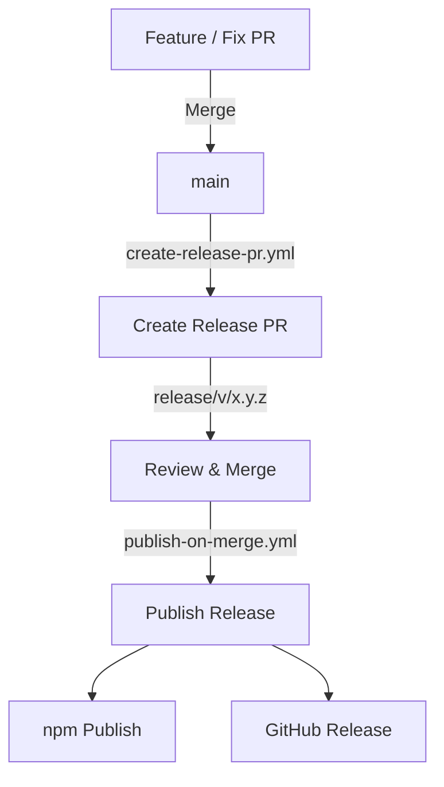

# 🎉 Release Suite

Semantic versioning tools for Git-based projects, providing automated version computation, changelog generation and release notes creation.

## 🚀 Features

- Automatic version bump based on commit messages
- Conventional commit parsing (custom prefixes supported)
- Auto-generated `CHANGELOG.md`
- Auto-generated `RELEASE_NOTES.md` using GitHub CLI (gh)
- Local preview mode (`CHANGELOG.preview.md`, `RELEASE_NOTES.preview.md`)
- CI/CD ready for GitHub Actions
- No commit rules enforced on the main project
- Trusted Publishing (OIDC) — no npm tokens required

## ⚙️ Installation

```bash
npm install release-suite --save-dev
```

## 🖥️ CLI Commands

| Command                     | Description                                               |
| --------------------------- | --------------------------------------------------------- |
| `rs-compute-version`        | Computes next semantic version based on git commits       |
| `rs-generate-changelog`     | Generates `CHANGELOG.md`                                  |
| `rs-generate-release-notes` | Generates `RELEASE_NOTES.md` using GitHub PRs             |
| `rs-preview`                | Generates preview changelog & release notes               |
| `rs-create-tag`             | Create and push a git tag based on `package.json` version |

## 🧠 Usage

Add to your project's `package.json`:

```json
{
  "scripts": {
    "version:compute": "rs-compute-version",
    "changelog": "rs-generate-changelog",
    "release:notes": "rs-generate-release-notes",
    "preview": "rs-preview create",
    "preview:clear": "rs-preview remove",
    "create-tag": "rs-create-tag",
    "create-tag:compute": "rs-create-tag --compute",
    "create-tag:dry": "rs-create-tag --dry-run"
  }
}
```

## 🤖 CI/CD Usage (GitHub Actions)

This project is designed to be used in automated pipelines.

Typical flow:

1. Create a Release PR (compute version, changelog, build)
2. Review and merge the Release PR into `main`
3. Publish the release (tag, npm, GitHub Release)

Example workflows:
- create-release-pr.yml
- publish-on-merge.yml

## 🔁 Release Flow

This project follows a **two-step release strategy** designed for safety,
automation and reusability.

### 1️⃣ Prepare Release (Create Release PR)

Triggered when:

- A PR is merged into `main`

Actions:

- Computes next semantic version
- Updates `package.json`
- Generates `CHANGELOG.md`
- Builds the project (if applicable)
- Opens a **Release PR** (`release/v/x.y.z`)

### 2️⃣ Publish Release

Triggered when:

- A Release PR (`release/v/*`) is merged into `main`

Actions:

- Creates a Git tag
- Publishes to npm using **Trusted Publishing (OIDC)**
- Generates GitHub Release Notes
- Uploads build artifacts (`dist/**`)

---

### 📊 Flow Diagram



✔️ Fully automated releases  
✔️ No npm tokens or secrets required (OIDC)  
✔️ No release loops  
✔️ Safe for concurrent merges  
✔️ Reusable in any project 

## 📦 Publishing to npm (Trusted Publishing)

This project uses **npm [Trusted Publishing](https://docs.npmjs.com/trusted-publishers) with GitHub Actions (OIDC)**.

- No npm tokens or secrets are required
- Publishing is handled entirely by GitHub Actions
- Triggered automatically when a Release PR is merged into `main`

## 🔍 Preview Mode

Generate preview files without touching your real changelog:

```bash
npm run preview
```

Remove previews:

```bash
npm run preview:clear
```

## 🛠 Development (Maintainers)

When working inside the `release-suite` repository itself, the CLI binaries
are **not available via npm or npx**, since they are not installed as a dependency.

In this case, run the scripts directly with Node.js:

```bash
node bin/compute-version.js
node bin/generate-changelog.js
node bin/generate-release-notes.js
node bin/preview.js create
node bin/create-tag.js
```

To test the CLI as a real consumer, you can use:

```bash
npm link
# or
npm install ../release-suite
```

## 📄 License

This project is licensed under the [MIT License](./LICENSE).

---

## ✨ Author

<table>
  <tr>
    <td align="center">
      <a href="https://jonasmzsouza.github.io/">
         
         <br />
         <sub><b>Jonas Souza</b></sub>
      </a>
    </td>
  </tr>
</table>
 
💼 [LinkedIn](https://linkedin.com/in/jonasmzsouza)
💻 [GitHub](https://github.com/jonasmzsouza)
