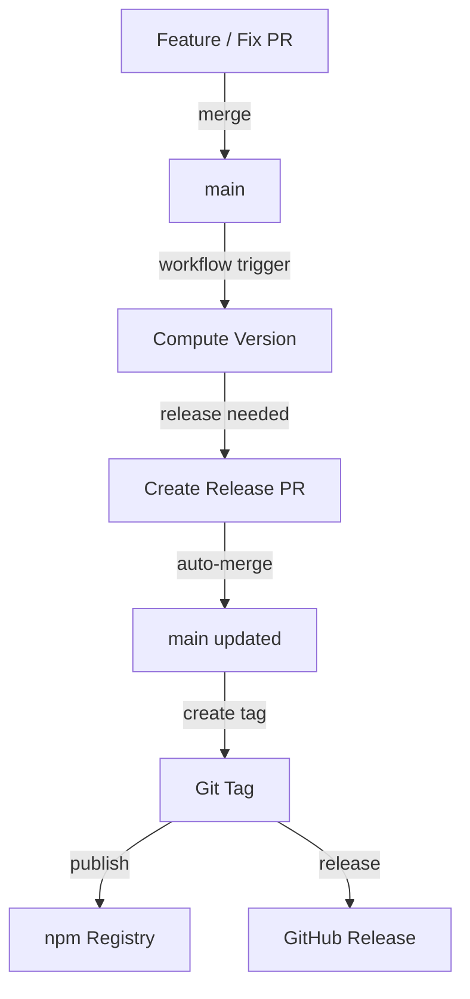

# 🎉 Release Suite

Semantic versioning tools for Git-based projects, providing automated version computation, changelog generation and release notes creation.

> Designed for safe, predictable and fully automated releases in GitHub Actions.

## 🚀 Features

- Automatic version bump based on commit messages
- Conventional commit parsing (custom prefixes supported)
- Auto-generated `CHANGELOG.md`
- Auto-generated `RELEASE_NOTES.md` using GitHub API
- Local dry-run mode (`CHANGELOG.dry-run.md`, `RELEASE_NOTES.dry-run.md`)
- CI/CD ready for GitHub Actions
- No commit rules enforced on the main project
- Trusted Publishing (OIDC) — no npm tokens required

## ⚡ Quick Start

```bash
npm install release-suite --save-dev
```

Add to your project's `package.json`:

```json
{
  "scripts": {
    "dry-run": "rs-dry-run create",
    "dry-run:clean": "rs-dry-run remove",
    "version:compute": "rs-version compute",
    "changelog": "rs-changelog generate",
    "release-notes": "rs-release-notes generate",
    "tag:create": "rs-tag create"
  }
}
```

Generate dry-run files without touching your real changelog:

```bash
npm run dry-run
```

Remove dry-run files:

```bash
npm run dry-run:clear
```

## ⚙️ Configuration

Release Suite can be configured using a `release.config.js` file.

This file controls:

- Git tag prefix (`v1.2.3` vs `1.2.3`)
- Emoji usage in changelog rendering

See [`docs/config.md`](docs/config.md) for full documentation.

---

## 🖥️ CLI Commands

| Command                     | Description                                                |
| --------------------------- | ---------------------------------------------------------- |
| `rs-version compute`        | Computes next semantic version based on git commits        |
| `rs-changelog generate`     | Generates a new changelog entry for the next release       |
| `rs-changelog rebuild` ⚠️   | Fully rebuilds CHANGELOG.md from git history (Danger Zone) |
| `rs-release-notes generate` | Generates RELEASE_NOTES.md                                 |
| `rs-dry-run`                | Generates dry-run changelog & release notes                |
| `rs-tag create`             | Creates and pushes a git tag                               |

Each command follows a strict and predictable CLI contract (exit codes, stdout, JSON mode).

> 💡 **Note about execution**
>
> ⚠️ `rs-changelog rebuild` is a destructive operation.
> Always use `--dry-run` first.
>
> - When using these commands via `npm run`, they can be referenced directly (`rs-*`).
> - In CI/CD environments (e.g. GitHub Actions), always invoke them using `npx`
>   (e.g. `npx rs-changelog generate`) to ensure proper binary resolution.

## 🔁 Release Flow

This project uses an automated, PR-based release strategy
designed for safety and traceability.

See [Release Process](docs/release-process.md) for details.

### 1️⃣ Create Release PR

Triggered when:

- A PR is merged into `main`
- Or the workflow is manually dispatched

Actions:

- Computes next semantic version
- Updates `package.json` and `CHANGELOG.md`
- Builds the project (if applicable)
- Opens and auto-merges a Release PR
- Creates a Git tag

### 2️⃣ Publish Release

Triggered automatically after the Release PR merge (only if tag exists).

Actions:

- Publishes to npm using **Trusted Publishing (OIDC)**
- Generates GitHub Release Notes
- Uploads build artifacts (`dist/**` if present)

---

### 📊 Flow Diagram


```mermaid
flowchart TD
    A[Feature / Fix PR] -->|merge| B[main]
    B -->|workflow trigger| C[Compute Version]
    C -->|release needed| D[Create Release PR]
    D -->|auto-merge| E[main updated]
    E -->|create tag| F[Git Tag]
    F -->|publish| G[npm Registry]
    F -->|release| H[GitHub Release]
```

✔️ Fully automated releases  
✔️ No npm tokens or secrets required (OIDC)  
✔️ No release loops  
✔️ Safe for concurrent merges  
✔️ Reusable in any project

## 🤖 CI/CD Usage (GitHub Actions)

> ℹ️ In CI/CD environments, always use `npx` when invoking `rs-*` commands.

This project is designed to be used in automated pipelines.

👉 See full examples in [`docs/ci.md`](./docs/ci.md)

## 📦 Publishing to npm (Trusted Publishing)

This project uses **npm [Trusted Publishing](https://docs.npmjs.com/trusted-publishers) with GitHub Actions (OIDC)**.

- No npm tokens or secrets are required
- Publishing is handled entirely by GitHub Actions
- Triggered automatically when a Release PR is merged into `main`

## 🧩 Programmatic API

Release Suite also exposes a programmatic API for advanced use cases
(integration tests, custom tooling, orchestration).

👉 See full API documentation in [`docs/api.md`](./docs/api.md)

## 🛠 Development (Maintainers)

When working inside the `release-suite` repository itself, the CLI binaries
are **not available via npm or npx**, since they are not installed as a dependency.

In this case, run the scripts directly with Node.js:

```bash
node bin/version.js compute
node bin/changelog.js generate
node bin/release-notes.js generate
node bin/dry-run.js create
node bin/tag.js create
```

To test the CLI as a real consumer, you can use:

```bash
npm link
# or
npm install ../release-suite
```

## 📄 License

This project is licensed under the [MIT License](./LICENSE).

---

## ✨ Author

<table>
  <tr>
    <td align="center">
      <a href="https://jonasmzsouza.github.io/">
         
         <br />
         <sub><b>Jonas Souza</b></sub>
      </a>
    </td>
  </tr>
</table>
 
💼 [LinkedIn](https://linkedin.com/in/jonasmzsouza)
💻 [GitHub](https://github.com/jonasmzsouza)
