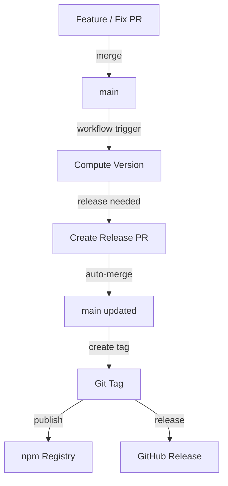

# GitHub Setup

This guide explains how to configure Release Suite with GitHub.

GitHub provides the most complete integration:

- GitHub Actions
- Pull Requests
- GitHub Releases
- OIDC Trusted Publishing

---

## Repository Configuration

Recommended branch protection for `main`:

- Require pull request before merging
- Require status checks
- Allow auto-merge
- Allow GitHub Actions to bypass PR requirements
- Workflow permissions: Read & Write
- Allow Actions to create and approve PRs

## ⚠️ Branch Protection & Auto-merge

This workflow is designed to work with protected branches.

### Required Reviews

If `main` requires pull request approvals:

- Release PRs **may not auto-merge** using `GITHUB_TOKEN`
- Recommended approaches:
  - Do not require reviews for release-only paths
  - Use CODEOWNERS to limit review requirements
  - Manually approve Release PRs when needed

Advanced setups may use a GitHub App or PAT with caution.

### Required Status Checks

Release PRs may be subject to required checks
(e.g. security scans like GitGuardian).

When auto-merge is enabled, GitHub will merge the PR
as soon as all required checks succeed, regardless of duration.

The workflow explicitly waits for the merge to complete
before creating tags or publishing.

---

## Workflow Permissions

```
contents: write
pull-requests: write
id-token: write
packages: write
```

These permissions allow the workflow to:

- create release PRs
- merge PRs
- create git tags
- publish packages

---

## Trusted Publishing (npm)

Enable **[Trusted Publishing](https://docs.npmjs.com/trusted-publishers) (OIDC)** in npm settings.

Benefits:

- No npm tokens
- OIDC authentication
- Automatic provenance

---

## Example Workflow

File:

```
github-actions.yml
```

Example pipeline:

```yml
name: Create & Publish Release

on:
  pull_request:
    types: [closed]
    branches: [main]
  workflow_dispatch:

permissions:
  id-token: write # 🔐 REQUIRED for OIDC
  contents: write
  pull-requests: write
  packages: write

concurrency:
  group: release-main
  cancel-in-progress: true

jobs:
  # ------------------------------------------------------------
  # JOB 1 — CREATE RELEASE PR + MERGE + TAG
  # ------------------------------------------------------------
  create:
    runs-on: ubuntu-latest
    timeout-minutes: 20
    env:
      GH_TOKEN: ${{ secrets.GITHUB_TOKEN }}

    # Job-level outputs = contract with publish job
    outputs:
      tag: ${{ steps.tag.outputs.tag }}

    # Only run when:
    # - manual dispatch OR
    # - PR merged into main AND it's NOT a release PR
    if: >
      github.event_name == 'workflow_dispatch' ||
      (
        github.event.pull_request.merged == true &&
        !contains(join(github.event.pull_request.labels.*.name, ','), 'release')
      )

    steps:
      - name: Checkout
        uses: actions/checkout@v4
        with:
          fetch-depth: 0
          persist-credentials: true

      - name: Setup Node
        uses: actions/setup-node@v4
        with:
          node-version: 24

      - name: Install dependencies
        run: npm ci

      # --------------------------------------------------------
      # Decide if a release should happen
      # --------------------------------------------------------
      - name: Compute next version
        id: compute
        run: |
          set +e
          RESULT=$(npx rs-version compute)
          STATUS=$?
          VERSION=$(echo "$RESULT" | jq -r '.nextVersion // empty')
          TAG_PREFIX=$(echo "$RESULT" | jq -r '.tagPrefix // ""')

          echo "$RESULT"

          if [ "$STATUS" -ne 0 ] || [ -z "$VERSION" ]; then
            echo "should_publish=false" >> $GITHUB_OUTPUT
          else
            echo "should_publish=true" >> $GITHUB_OUTPUT
            echo "version=$VERSION" >> $GITHUB_OUTPUT
            echo "tagPrefix=$TAG_PREFIX" >> $GITHUB_OUTPUT 
          fi

      # --------------------------------------------------------
      # Prepare release artifacts
      # --------------------------------------------------------
      - name: Bump package.json
        if: steps.compute.outputs.should_publish == 'true'
        run: npm version ${{ steps.compute.outputs.version }} --no-git-tag-version

      - name: Sync package-lock.json
        if: steps.compute.outputs.should_publish == 'true'
        run: npm install --package-lock-only

      - name: Build
        run: npm run build --if-present

      - name: Generate changelog
        if: steps.compute.outputs.should_publish == 'true'
        run: npx rs-changelog generate

      # --------------------------------------------------------
      # Stage files (dist is optional)
      # --------------------------------------------------------
      - name: Stage release files
        if: steps.compute.outputs.should_publish == 'true'
        run: |
          git add package.json package-lock.json CHANGELOG.md
          [ -d dist ] && git add dist || true
          git status --short

      # --------------------------------------------------------
      # Create Release PR
      # --------------------------------------------------------
      - name: Create Release PR
        id: pr
        if: steps.compute.outputs.should_publish == 'true'
        uses: peter-evans/create-pull-request@v6
        with:
          token: ${{ secrets.GITHUB_TOKEN }}
          branch: release/${{ steps.compute.outputs.tagPrefix }}${{ steps.compute.outputs.version }}
          title: ":bricks: chore(release): ${{ steps.compute.outputs.tagPrefix }}${{ steps.compute.outputs.version }} [skip ci]"
          commit-message: ":bricks: chore(release): prepare version ${{ steps.compute.outputs.tagPrefix }}${{ steps.compute.outputs.version }} [skip ci]"
          labels: release
          delete-branch: true
          assignees: ${{ github.event.pull_request.merged_by.login }}
          body: |
            Automated release PR.

            - Version bump: ${{ steps.compute.outputs.tagPrefix }}${{ steps.compute.outputs.version }}
            - Updated changelog
            - Build artifacts included if present

            Merging this PR will trigger publish automatically.

      # --------------------------------------------------------
      # Merge Release PR (best-effort)
      # --------------------------------------------------------
      - name: Merge Release PR
        if: steps.pr.outputs.pull-request-number != ''
        run: |
          PR=${{ steps.pr.outputs.pull-request-number }}
          echo "Merging PR #$PR"
          if ! gh pr merge "$PR" --squash --admin; then
            echo "Immediate merge failed, attempting to enable auto-merge"
            gh pr merge "$PR" --auto --squash
          fi

      # --------------------------------------------------------
      # ⏳ WAIT FOR MERGE (CRITICAL)
      # --------------------------------------------------------
      - name: Wait for Release PR to be merged
        if: steps.pr.outputs.pull-request-number != ''
        run: |
          PR=${{ steps.pr.outputs.pull-request-number }}

          echo "Waiting for PR #$PR to be merged..."
          for i in {1..60}; do
            MERGED_AT=$(gh pr view "$PR" --json mergedAt -q .mergedAt)
            if [ "$MERGED_AT" != "null" ] && [ -n "$MERGED_AT" ]; then
              echo "PR merged at $MERGED_AT"
              exit 0
            fi
            sleep 5
          done

          echo "Timed out waiting for PR merge"
          exit 1

      # --------------------------------------------------------
      # Create Git tag
      # --------------------------------------------------------
      - name: Create tag
        id: tag
        if: steps.pr.outputs.pull-request-number != ''
        run: |
          git fetch origin main
          git checkout main
          git reset --hard origin/main

          git config user.name "github-actions[bot]"
          git config user.email "github-actions[bot]@users.noreply.github.com"

          RESULT=$(npx rs-tag create)
          TAG=$(echo "$RESULT" | jq -r '.tag')

          echo "$RESULT"
          echo "tag=$TAG" >> $GITHUB_OUTPUT

  # ------------------------------------------------------------
  # JOB 2 — PUBLISH (only if tag exists)
  # ------------------------------------------------------------
  publish:
    needs: create
    runs-on: ubuntu-latest
    timeout-minutes: 15
    env:
      GH_TOKEN: ${{ secrets.GITHUB_TOKEN }}

    if: needs.create.outputs.tag != ''

    steps:
      - name: Checkout tag
        uses: actions/checkout@v4
        with:
          ref: ${{ needs.create.outputs.tag }}
          fetch-depth: 0
          persist-credentials: true

      - name: Setup Node (npm OIDC)
        uses: actions/setup-node@v4
        with:
          node-version: 24
          registry-url: https://registry.npmjs.org
          always-auth: true

      - name: Install dependencies
        run: npm ci

      # --------------------------------------------------------
      # Assert tag matches package.json
      # --------------------------------------------------------
      - name: Assert tag matches package.json
        run: |
          VERSION=$(node -p "require('./package.json').version")
          TAG=${{ needs.create.outputs.tag }}

          if [ "$VERSION" != "$TAG" ]; then
            echo "Version mismatch!"
            exit 1
          fi

      # --------------------------------------------------------
      # Guard: version already published?
      # --------------------------------------------------------
      - name: Guard against duplicate publish
        id: guard
        run: |
          VERSION=$(node -p "require('./package.json').version")
          if npm view "$(node -p "require('./package.json').name")@$VERSION" version >/dev/null 2>&1; then
            echo "exists=true" >> $GITHUB_OUTPUT
          else
            echo "exists=false" >> $GITHUB_OUTPUT
          fi

      # --------------------------------------------------------
      # Publish to npm using Trusted Publishing (OIDC)
      # --------------------------------------------------------
      - name: Publish to npm (Trusted Publishing)
        if: steps.guard.outputs.exists != 'true'
        run: npm publish

      # --------------------------------------------------------
      # Generate release notes for GitHub Release
      # --------------------------------------------------------
      - name: Generate GitHub Release Notes
        run: npx rs-release-notes generate

      # --------------------------------------------------------
      # Create GitHub Release with notes and attach built assets
      # --------------------------------------------------------
      - name: Create GitHub Release
        env:
          GITHUB_TOKEN: ${{ secrets.GITHUB_TOKEN }}
        run: |
          ASSETS=()
          if [ -d dist ]; then
            ASSETS=(dist/**)
          fi

          gh release create "${{ needs.create.outputs.tag }}" \
            --title "${{ needs.create.outputs.tag }}" \
            --notes-file RELEASE_NOTES.md \
            "${ASSETS[@]}"
```

| Job     | Purpose                    |
| ------- | -------------------------- |
| create  | creates release PR and tag |
| publish | publishes package          |

---

## 1️⃣ Create Release PR

Triggered when:

- A PR is merged into `main`
- Or the workflow is manually dispatched

Actions:

- Computes next semantic version
- Updates `package.json` and `CHANGELOG.md`
- Builds the project (if applicable)
- Opens and auto-merges a Release PR
- Creates a Git tag

---

## 2️⃣ Publish Release

Triggered automatically after the Release PR merge (only if tag exists).

Actions:

- Publishes to npm using **Trusted Publishing (OIDC)**
- Generates GitHub Release Notes
- Uploads build artifacts (`dist/**` if present)

---

## 📊 Flow Diagram



✔️ Fully automated releases  
✔️ No npm tokens or secrets required (OIDC)  
✔️ No release loops  
✔️ Safe for concurrent merges  
✔️ Reusable in any project

---

## GitHub Release Creation

Release notes are generated automatically:

```
npx rs-release-notes generate
```

Then attached to the GitHub release using:

```
gh release create
```

---

## Required Tools

GitHub runners already include:

- Node.js
- Git
- gh CLI
- jq
